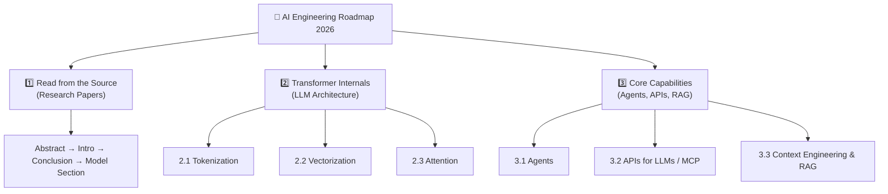
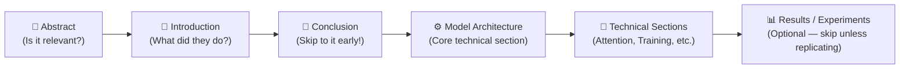
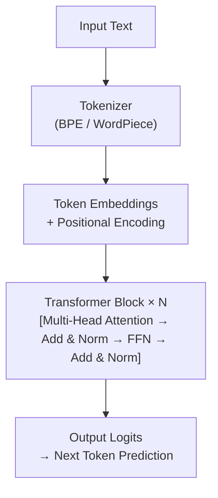
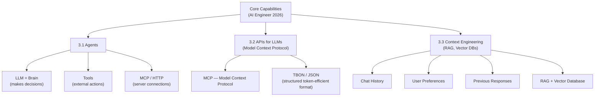
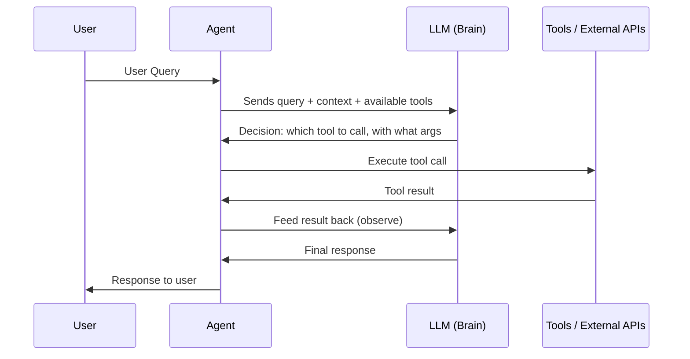
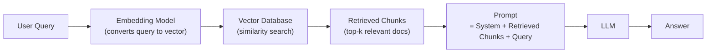
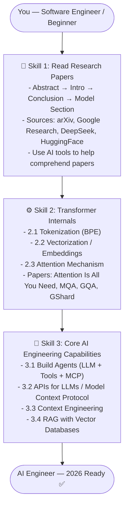

# 🤖 AI Engineering Roadmap 2026 — Detailed Notes

> Based on a live stream session covering the essential skills, resources, and learning path for becoming a proficient AI Engineer in 2026.

---

## Overview

This is **not** a typical "do this, then do this" checklist roadmap. It is a **skill-based roadmap** — focusing on *what kind of thinker and engineer you need to become*, not just what tools to install.

There are **3 major pillars** to master:



---

## Pillar 1 — Read from the Source (Research Papers)

### Why Research Papers?

Most engineers learn from blogs, YouTube videos, and courses. These are useful — like a **protein bar** — they give you the top 20% of knowledge quickly. But **90% of the real depth lives in research papers**. Even good books can't match the specificity and density of information that a well-cited paper offers.

The analogy to other engineering disciplines is powerful:

| Engineering Domain | Must-Know Internals |
|---|---|
| Database Engineer | B+ Tree, Log-Structured Merge Tree (LSM) |
| Network Engineer | HTTP, UDP, TCP protocols |
| AI Engineer | Transformer architecture, Attention mechanism |

Just as a database engineer doesn't *build* a database from scratch but *must understand* how B+ trees work — an AI engineer must understand how LLMs work, even without writing CUDA kernels.

---

### How to Read a Research Paper (Step-by-Step)

Reading a paper straight through from start to finish is **inefficient and discouraging**. Here is the proven efficient strategy:



**Step 1 — Abstract:** Read this always. It tells you in 5–10 sentences what the paper is about and whether it is worth your time. A paper with hundreds or thousands of citations is almost always worth reading.

**Step 2 — Introduction:** Read the full introduction. It sets the context — what problem exists, what prior work has been done, and what this paper contributes. It is narrative and much easier to read than the math sections.

**Step 3 — Jump to the Conclusion:** Before diving into the model, read the conclusion. The introduction and conclusion together tell you whether the paper is **relevant to you**. Many papers in AI exist for marketing purposes — researchers want visibility in a hot field. If the results are vague or the claims are hypothetical, skip the paper.

**Step 4 — Model Architecture (Section 3 typically):** This is the core technical part. Study it carefully. Diagrams in this section are extremely helpful — even if you can't write the algorithm yourself, the diagram gives you a conceptual map of what is happening.

**Step 5 — Remaining Technical Sections:** Go through the technical sections like the attention mechanism, training procedure, etc. You can skip deeply mathematical derivations initially, but revisit them if you need deeper understanding.

**Step 6 — Results and Experiments (Optional):** Skip unless you are replicating the results or doing a very deep comparative analysis.

---

### Example: *Attention Is All You Need*

This is the foundational transformer paper. It will feel dry and dense at first. Suggested reading order:

1. Read the abstract — understand this introduces the Transformer architecture
2. Read the introduction — context around RNNs and their limitations
3. Jump to the conclusion — see the key claims
4. Study **Section 3: Model Architecture** — the encoder-decoder structure, multi-head attention, positional encoding
5. Read the attention mechanism section carefully
6. Optionally read the training section

---

### Example: *GShard — Mixture of Experts*

GShard has ~1,000 citations, making it highly credible. It covers how to scale transformers using Mixture of Experts (MoE).

- Abstract + Introduction: Read fully
- Model section: Essential — shows how matrices are split into expert shards
- Highly parallel implementation section: Can be skipped unless you're doing systems work
- Performance and memory consumption: Useful to read as an engineer understanding trade-offs

Key insight from GShard: the diagrams alone give you a conceptual understanding of how the matrices are being split into pieces across experts, even before you understand the full math.

---

### Where to Find Good Papers

| Source | Quality | Notes |
|---|---|---|
| **Google Research** | ⭐⭐⭐⭐⭐ | Excellent, often comes with a blog post explaining the paper |
| **DeepSeek** | ⭐⭐⭐⭐ | Very open and technically detailed |
| **Hugging Face Papers** | ⭐⭐⭐⭐ | Good curation of recent ML papers |
| **Meta Research** | ⭐⭐⭐ | Hit or miss — some great papers, some feel like marketing |
| **OpenAI** | ⭐⭐ | Since 2023, increasingly hides technical details; heavy on ethics sections |
| **Amazon Research** | ⭐⭐⭐ | Sometimes good, sometimes too marketing-focused |
| **arXiv** | ⭐⭐⭐⭐ | The raw source — all preprints are here |

**Recommended GitHub resource list:** [InterviewReady/ai-engineering-resources](https://github.com/InterviewReady/ai-engineering-resources) — curated white papers ordered in the flow you should read them. Start with Byte Pair Encoding, not "Attention Is All You Need."

**Recommended YouTube:** Andrej Karpathy's channel and **Yannic Kilcher** — breaks down white papers clearly. Note: his focus is knowledge and research understanding, not job readiness.

---

### Using AI to Help You Read Papers

You don't have to struggle through a paper alone. The recommended workflow:

1. **Download the PDF** of the paper (do not just give ChatGPT a link — it often hallucinates from URLs)
2. **Upload the PDF** into ChatGPT or similar
3. Ask: *"Explain this paper to me section by section"*
4. Follow up with clarifying questions: *"Can you explain the math in Section 3 with an example?"*
5. Once you have a general understanding, go back and read the paper yourself

ChatGPT is **good at summarizing** papers and **bad at making decisions**. Use it for comprehension, not judgment.

**NotebookLM** is also excellent for text-based study — you can load multiple papers and ask cross-paper questions.

---

## Pillar 2 — Transformer Internals

### Why You Must Know This

Large Language Models (LLMs) are built on the **Transformer** architecture. Even as newer architectures emerge (diffusion-based models, state space models), the transformer remains central. Understanding its internals helps you:

- Know **which model** fits your use case
- Understand **trade-offs** between models (cost, speed, reasoning quality)
- Diagnose problems when agents or pipelines behave unexpectedly
- Avoid imposter syndrome — you know *why* something works

Think of it like protocols in networking. You don't build TCP from scratch, but you *must* understand how it works to design reliable networked systems.

---

### 2.1 — Tokenization

Tokenization is the process of converting raw text into a sequence of **tokens** that the model can process numerically.

**How it works conceptually:**

Raw text like `"Hello, world!"` is broken into subword units. For example:

```
"Hello, world!" → ["Hello", ",", " world", "!"]
```

But modern tokenizers go further using algorithms like **Byte Pair Encoding (BPE)** — which starts with individual characters and iteratively merges the most frequent adjacent pairs into new tokens.

**Why BPE?**

- It handles unknown words gracefully by breaking them into known subwords
- It balances vocabulary size vs. sequence length
- It is language-agnostic

The paper to read: **Byte Pair Encoding (Neural Machine Translation of Rare Words with Subword Units)** — this is the recommended starting paper in the GitHub resource list.

**Key vocabulary:**

| Term | Meaning |
|---|---|
| Token | The basic unit fed into the model (could be a word, subword, or character) |
| Vocabulary | The fixed set of all tokens the model knows |
| Tokenizer | The algorithm that maps text → token IDs |
| Token ID | An integer index representing a token in the vocabulary |

---

### 2.2 — Vectorization (Embeddings)

After tokenization, each token ID is converted into a **dense numerical vector** called an **embedding**. This is how the model represents meaning mathematically.

**Intuition:** Words with similar meanings end up close together in vector space.

$$\vec{v}_{\text{king}} - \vec{v}_{\text{man}} + \vec{v}_{\text{woman}} \approx \vec{v}_{\text{queen}}$$

This is the famous word vector analogy — meaning is encoded geometrically.

**Embedding Matrix:** If the vocabulary has $V$ tokens and embeddings have dimension $d$, then the embedding layer is a matrix:

$$E \in \mathbb{R}^{V \times d}$$

Each token ID $i$ is mapped to a row $E_i$, which is its embedding vector. In practice for modern LLMs, $d$ is typically 768, 1024, 2048, or larger.

**Why vectors?**

- Vectors allow mathematical operations (addition, dot products, cosine similarity)
- They capture semantic relationships in a continuous space
- The model can learn to adjust these vectors during training

---

### 2.3 — Attention Mechanism

Attention is the core innovation of the Transformer. It allows the model to **focus on different parts of the input** when computing the representation of each token.

**The core idea:**

When the model processes the word *"bank"* in the sentence *"I went to the river bank"*, attention lets it look at *"river"* to understand that this is a geographical bank, not a financial one.

**Scaled Dot-Product Attention:**

Given input sequence of token embeddings, attention computes three matrices using learned weight matrices:

$$Q = XW_Q \quad (\text{Queries})$$
$$K = XW_K \quad (\text{Keys})$$
$$V = XW_V \quad (\text{Values})$$

The attention output is:

$$\text{Attention}(Q, K, V) = \text{softmax}\left(\frac{QK^T}{\sqrt{d_k}}\right)V$$

**Step-by-step breakdown:**

**Step 1** — Compute raw attention scores (how much should token $i$ attend to token $j$?):

$$\text{score}_{ij} = Q_i \cdot K_j$$

**Step 2** — Scale by $\sqrt{d_k}$ to prevent gradients from vanishing when $d_k$ is large:

$$\text{scaled\_score}_{ij} = \frac{Q_i \cdot K_j}{\sqrt{d_k}}$$

**Step 3** — Apply softmax to convert scores into a probability distribution (weights that sum to 1):

$$\alpha_{ij} = \frac{e^{\text{scaled\_score}_{ij}}}{\sum_k e^{\text{scaled\_score}_{ik}}}$$

**Step 4** — Compute weighted sum of Values:

$$\text{output}_i = \sum_j \alpha_{ij} V_j$$

**Multi-Head Attention:**

Instead of one set of Q, K, V, the transformer runs $h$ attention heads in parallel, each learning different aspects of relationships:

$$\text{MultiHead}(Q, K, V) = \text{Concat}(\text{head}_1, ..., \text{head}_h) W^O$$

where each head is:

$$\text{head}_i = \text{Attention}(QW_i^Q,\ KW_i^K,\ VW_i^V)$$

**Why does this matter for engineers?**

Understanding attention helps you reason about:
- **Context window limits** — attention is $O(n^2)$ in sequence length, which is why long contexts are expensive
- **Multi-Query Attention (MQA) and Grouped-Query Attention (GQA)** — optimizations that reduce the memory cost of the K and V matrices during inference, making models faster and cheaper to serve

---

### Transformer Architecture: Full Picture



**Key papers to read for Transformer internals:**

| Paper | What it covers |
|---|---|
| *Attention Is All You Need* | The original Transformer — encoder-decoder, multi-head attention |
| *Multi-Query Attention* | Shares Keys/Values across heads to reduce memory |
| *Grouped-Query Attention (GQA)* | Groups heads together — a middle ground between MHA and MQA |
| *GShard / Mixture of Experts* | Scales transformers by routing tokens to specialized sub-networks |

---

### Model Trade-offs: DeepSeek vs ChatGPT

Understanding internals lets you reason about product trade-offs:

| Model | Trade-off Made | Result |
|---|---|---|
| **DeepSeek** | More inference time (chain-of-thought), MoE routing | Better at math & logic, cheaper to run |
| **ChatGPT** | Massive compute spend on RLHF for communication | Better conversational quality, more expensive |

These are not random decisions — they flow directly from architectural and training choices that you can understand by reading the papers.

---

## Pillar 3 — Core Capabilities of the AI Engineer (2026)

These are the practical, hands-on skills. Like how any software engineer can hit REST APIs, use auth tokens, and interact with databases — an AI engineer in 2026 is expected to have these capabilities.



---

### 3.1 — Agents

An **agent** is a piece of code that uses an LLM to make decisions, then executes actions in the real world using tools.

**Core mental model:**



The loop is: **Ask LLM → Execute → Observe → Ask LLM again** until the task is complete.

**What makes agents hard:**

- **Hallucinations:** The LLM might call a tool with wrong arguments or invent tool names
- **Multi-step planning:** The LLM must maintain coherent plans across many tool calls
- **Error recovery:** When a tool fails, the agent must handle it gracefully
- **Context overflow:** Long task histories can exceed the context window

**Frameworks to explore:**

- **LangChain / LangGraph** — popular Python frameworks for building agents
- **AutoGen** — multi-agent collaboration framework by Microsoft
- **CrewAI** — role-based multi-agent systems

> Build an agent yourself. See how it breaks. Understanding *why* it breaks is most of the job.

---

### 3.2 — APIs for LLMs & Model Context Protocol (MCP)

**Model Context Protocol (MCP)** is a standardized way for agents to connect to external tools and data sources, analogous to how HTTP is a standard for web communication.

**Why MCP matters:**

Instead of writing custom integration code for every tool (search engine, database, file system, calendar), MCP provides a unified protocol. An LLM-powered agent can discover and use any MCP-compatible server without bespoke code.

**TBON / JSON for LLM communication:**

One approach gaining traction is using **structured JSON** extensively when communicating with LLMs. Benefits:

- Reduces token count (more efficient)
- Gives the LLM precise, machine-parseable context
- Makes responses easier to validate and route programmatically

Example — instead of:
> *"The user's name is Alice and she is 28 years old and prefers dark mode."*

Send:
```json
{
  "user": {
    "name": "Alice",
    "age": 28,
    "preferences": { "theme": "dark" }
  }
}
```

This is cleaner, cheaper in tokens, and unambiguous.

---

### 3.3 — Context Engineering (formerly "Prompt Engineering")

**Context engineering** is the broader discipline of designing what information you give the LLM, and how. It encompasses everything that shapes the model's response quality.

Context engineering includes:

| Component | Description |
|---|---|
| **System Prompt** | Defines the agent's role, rules, and constraints |
| **Chat History** | Previous turns of conversation so the model remembers context |
| **User Preferences** | Personalization data stored and injected at runtime |
| **Previous Responses** | Can be fed back to allow the model to improve iteratively |
| **Retrieved Documents (RAG)** | External knowledge fetched from a vector database |

---

### 3.4 — RAG: Retrieval-Augmented Generation

RAG is the most standard and battle-tested pattern in production AI systems. Instead of relying on what the LLM memorized during training, you **retrieve relevant information at runtime** and inject it into the context.



**How RAG works step by step:**

**Step 1 — Indexing (done offline):**
- Take your documents (PDFs, wikis, support tickets, etc.)
- Split into chunks (e.g., 512 tokens each with overlap)
- Embed each chunk using an embedding model: $\vec{c} = \text{Embed}(\text{chunk})$
- Store all chunk vectors in a vector database (Pinecone, Weaviate, ChromaDB, pgvector)

**Step 2 — Retrieval (done at query time):**
- Embed the user's query: $\vec{q} = \text{Embed}(\text{query})$
- Find the top-$k$ chunks by cosine similarity:
$$\text{sim}(\vec{q}, \vec{c}) = \frac{\vec{q} \cdot \vec{c}}{|\vec{q}|\ |\vec{c}|}$$

**Step 3 — Generation:**
- Build a prompt: `[System] + [Retrieved Chunks] + [User Query]`
- Send to LLM → get a grounded, factual response

**Why RAG matters:**
- Keeps LLM responses grounded in your actual data
- Avoids hallucination on domain-specific facts
- No need to fine-tune the model (expensive) — just update the vector DB (cheap)

---

## Summary: The 3-Skill Roadmap at a Glance



| Skill | Time Investment | Outcome |
|---|---|---|
| Reading Research Papers | Ongoing habit | Deep, accurate knowledge from primary sources |
| Transformer Internals | 2–4 weeks focused study | Understand *why* models behave as they do |
| Agents + RAG + APIs | Build projects over 1–3 months | Hands-on capability for real-world AI systems |

---

## Recommended Resources

### Papers (in reading order)
1. Byte Pair Encoding *(start here)*
2. Attention Is All You Need
3. Multi-Query Attention
4. Grouped-Query Attention
5. GShard (Mixture of Experts)

### Where to Find Papers
- **arXiv.org** — all preprints
- **Google Research** (research.google) — with companion blog posts
- **DeepSeek** — technically detailed and open
- **Hugging Face Papers** (huggingface.co/papers)

### Tools for Studying Papers
- **ChatGPT** — upload PDF, ask questions, get math explained
- **NotebookLM** — load multiple papers, cross-reference
- **Yannic Kilcher (YouTube)** — research paper breakdowns

### GitHub
- [InterviewReady/ai-engineering-resources](https://github.com/InterviewReady/ai-engineering-resources) — curated white papers in suggested reading order

---

## Key Takeaways

1. **Don't fear research papers.** Use AI tools to break them down. You don't need to understand every equation on first read.

2. **You don't need to implement everything.** You don't implement B+ trees to be a DB engineer. You don't need to write a CUDA kernel to understand attention. But you *must* understand the concepts.

3. **Agents are the job in 2026.** Build one. Break it. Fix it. The cycle of build → observe failure → understand why is the fastest path to expertise.

4. **Context engineering > prompt engineering.** It's not just about writing good prompts — it's about architecting what information flows into the LLM and when.

5. **RAG is the standard pattern.** If you can build a RAG system from scratch with a vector database, you are ready for most production AI engineering roles.

> *"If you do these three things, you're going to do really well. These are not rocket science. Anyone can read research papers. Anyone can understand the internals of a transformer."*
